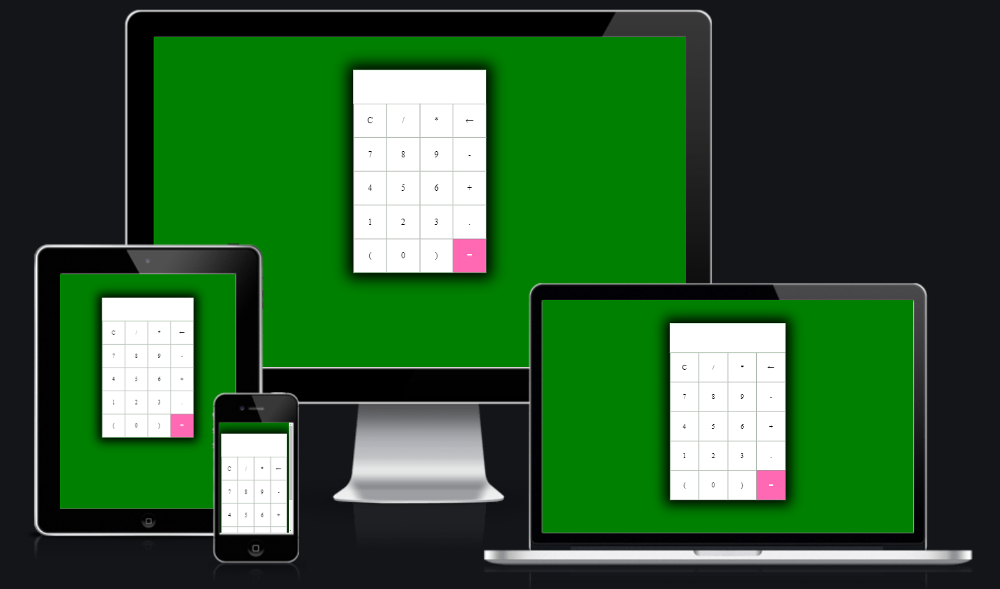

This project is all about maths. When you struggle with
your own calculations, I have made the best solution
out there for you! A working calculator on the web, which counts 
+, -, * and / in milliseconds! You simply put your math question 
in using the buttons and then press =, and the calculator will do the rest!

***Features***      
          
The features on the calculator are really simple to understand.
The buttons on the top of the calculator are C, /, * and a left arrow.
The C is for Clear, it clears all the data in the output window.
The / is to make calculations using division, and the * is for multiplication.
The left arrow removes one number per click in the output window, unlike the 
C which clears the whole window.         
The row below consists of 7, 8, 9 and a -.
The numbers do obviously input that number into the output window, and
the - is for making calculations using subtraction.        
On the row below that one you'll find 4, 5, 6 and a +.
Just like the line above the numbers will be used to make up your calculation,
and the + is to make calculations using addition.        
The row below this one consits of 1, 2, 3 and a dot(.).
The numbers, just like before, is to build up your calculations, and
the dot is to make numbers that use commas, so 1.5 or 3.64 for example.         
The row on the bottom is a little more special than the ones above.
This row consists of a (, a 0, a ) and an =. The parantheses are used for more
complicated math problems where they will be needed, and the equal sign is where you
press once you have put in your math problem that you want to calculate.       
         
**Features left to implement**                 
I wish I would have had enough time to make the calculator work on a keyboard,
but this is the only thing that I feel is missing for it to be perfect, just like I want it.
This will be implemented in the future.           

***Testing***           
There has been a lot of testing done during this project. I do the testing
just so that I know where the bugs are coming from, so that I don't code the whole
project at once without any testing, and have to look for the bugs afterwards.       
I feel more comfortable solving any bugs immediately instead of when I'm almost done coding.
With the JavaScript code I put a temporary alert for buttons to know that it worked.      
GitPod challenged me by throwing unexpected errors, but this was solved without
any bigger problems.             
I have done a lighthouse test for the site, so that it looks alright, which it most certainly did:

I did also test the site via the Jigsaw validator. Looks alright there too!

To make sure that my site will be used by as many as possible, I have checked so that it is responsive on all devices. This works just as intended, as shown below.
          

**Deployment**          
This website was deplyoed to GitHub Pages. These are the steps I used to do so:
- When in the GitHub repository you press the Settings tab
- When in the settings tab, you press "Pages" on the left side of the page.
- When you have pressed pages you click on "Branch", and after this you select main. 
- When this is done you should get a box with a green background that says the following: "Your site is published at: https://[username].github.io/[repository-name]/

The live link to my website can be found here: https://wagge4.github.io/project--two/         

**Credits**         
I as a developer struggle to keep every line of code in my head, and this is where tutorials, other coders and helping websites come in handy.             
I have used help from the following sources in my development:          
 My own knowledge, W3Schools, StackOverflow, my Slack friend Erik Olsson, a relative to me who is a professional coder and also YouTube videos. 
